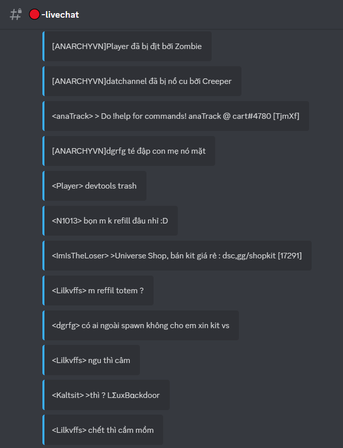
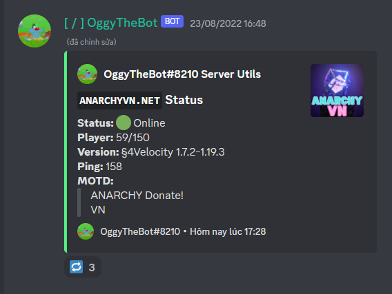

# Thông tin về các lệnh của Oggy
## I. Mục lục:
### 1. Commands:
- [Users:](#User)
    - [botinfo](#•-botinfo)
    - [check](#•-check)
    - [config](#•-config)
    - [help](#•-help)
    - [permission](#•-permission)
    - [ping](#•-ping)
    - [status](#•-status)
    - [support](#•-support)
- [Servers:](#•-Servers)
    - [players](#•-players)
    - [queue](#•-queue)
    - [anarchyvn](#•-anarchyvn)
    - [stats](#•-stats)
    - [tablist](#•-tablist)
### 2. Other:
- [Channels](#channels)
    - [livechat](#•-livechat-channel)
    - [restart](#•-restart-channel)
    - [status](#•-status-channel)
- [Roles](#roles)
    - [restart](#•-restart-role)
- [Messages](#messages)
    - [restart](#•-restart-message)
    - [status](#•-status-message)
## II. Thông tin về các lệnh
### 1. Commands:
## User
#### • botinfo 
    - Mô tả: Dùng để hiển thị các thông tin về bot
    - Cách dùng: /botinfo
#### • check
    - Mô tả: Kiểm tra xem user có đang bị bot chặn hay không
    - Cách dùng: /check <user>
       | <user>: User muốn kiểm tra (bắt buộc)
#### • config
    - Mô tả: Chỉnh sửa các cái đặt của bot
    - Cách dùng
        |  /config create: Tạo mới config
        |  /config set
        |   |  /config set channel <type> <channel> [message_or_role] [lock_channel] : Chỉnh các channel (kênh) chức năng
        |   |   | <type>: Loại channel muốn dùng (livechat, restart, status) (bắt buộc)
        |   |   | <channel>: Channel muốn dùng (bắt buộc)
        |   |   | [messgae_or_role]: Gửi tin nhắn chức năng hoặc reaction role (mặc định: có)
        |   |   | [lock_channel]: Khóa kênh đó (mặc định: có)
        |   |  /config set role <type> <role>: Chỉnh cái role (vai trò) chức năng
        |   |   | <type>: Loại role muốn dùng (restart) (bắt buộc)
        |   |   | <role>: Role muốn dùng (bắt buộc)
        |   |  /config set message <type> <id>
        |   |   | <type>: Loại message muốn dùng (bắt buộc)
        |   |   | <id>: ID của message muốn chỉnh thành (bắt buộc)
        |  /config feature <feature> <type>: Chỉnh các tính năng của bot
        |   | <feature>: Tính năng muốn chỉnh sửa (bắt buộc)
        |   | <type>: Bật hoặc tắt, chỉnh thành tin nhắn văn bản hoặc tin nhắn embed (bắt buộc)
        |  /config show: Hiện toàn bộ cài đặt của bot
        |  /config delete: Xóa toàn bộ cài đặt của bot
#### • help
    - Mô tả: Hiện menu thông tin về các lệnh của bot
    - Cách dùng: /help
#### • permission
    - Mô tả: Kiểm tra các quyền mà bot yêu cầu
    - Cách dùng: /permission
#### • ping
    - Mô tả: Kiểm tra độ trễ của bot, websocket và database
    - Cách dùng: /ping
#### • status
    - Mô tả: Nhận thông tin về các server.
    - Cách dùng: /status <server> [port]
       | <server>: IP của server (bắt buộc)
       | [port]: Cổng của server (mặc định: 25565)
#### • support
    - Mô tả: Link dẫn vào Support Server của Oggy
    - Cách dùng: /support
## Server
#### • players
    - Mô tả: Hiện tất cả toàn bộ người chơi trong server
    - Cách dùng: /players
*P/s: Dùng /tablist cho nhanh :))*
#### • queue
    - Mô tả: Hiện thông tin về hàng chờ
    - Cách dùng: /queue
*P/s: Trong mọi trường hợp thì nó cũng chỉ trả về số 0 mà thôi ;-;*
#### • anarchyvn
    - Mô tả: Hiện thông tin về anarchyvn.net (giống lệnh /status nhưng server đã được chỉ định)
    - Cách dùng: /anarchyvn
#### • stats
    - Mô tả: Hiện thông tin về một người chơi trong server (Hiện đang dùng API của mo0nbot)
    - Cách dùng: /stats <type> <user_name>
       | <type>: Loại thông tin cần lấy (bắt buộc)
       | <user_name>: Tên người chơi cần lấy thông tin
#### • tablist
    - Mô tả: Kiểm tra tablist của server
    - Cách dùng: /tablist
### 2. Other:
## Channels
#### • livechat (channel)
    - Mô tả: Là kênh chức năng để hiện các tin nhắn trong server và để gửi tin nhắn lện server
    - Ví dụ:

#### • restart (channel)
    - Mô tả: Là kênh chức năng thông báo khi server restart (hiện không dùng được)
    - Ví dụ:

#### • status (channel)
    - Mô tả: Là kênh chức năng dùng cho việc hiện thông tin về server anarchyvn.net (chức năng giống lệnh /anarchyvn)
    - Ví dụ:

## Roles
#### • restart (role)
    - Mô tả: Là role sẽ được ping khi server restart (hiện không dùng được)
## Messages
#### • status (message)
    - Mô tả: Tin nhắn chức năng, khi nhấn nút 🔁 thì tin nhắn sẽ cập nhật thông tin mới của server
#### • restart (message)
    - Mô tả: Tin nhắn chức năng, khi nhấn nút 📢 thì sẽ cho role restart tương ứng trong server