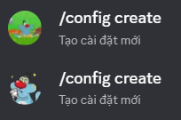
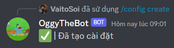
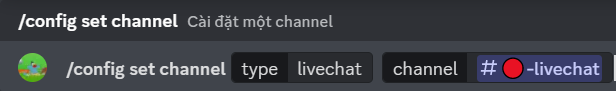
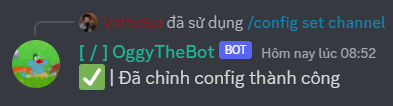
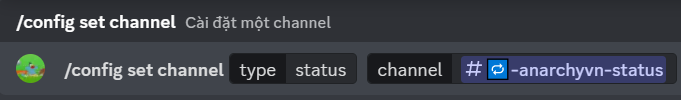

# Hướng dẫn sử dụng Oggy
## 1. Setup Oggy
- Nhập `/config` vào thanh chat.
- Chọn dòng `/config create`.

    

- Khi bot nhắn tin nhắn sau có nghĩa là bạn đã có thể dùng bot rồi đấy

    

## 2. Setup Livechat Channel
- Nhập `/config` vào thanh chat.
- Chọn dòng `/config set channel`.

    

- Tại ô `type` chọn `livechat`.
- Tại ô `channel` chọn kênh muốn dùng.

    

- Nhấn `enter` để gửi lệnh.
- Khi bot gửi tin nhắn sau có nghĩa là bạn đã có thể dùng kênh livechat rồi đấy

    

- **Lưu ý**: Bạn vui lòng chờ 1-5 giây để bot có thể gửi tin nhắn vào channel bạn vừa chỉnh.
## 3. Setup Status Channel
- Nhập `/config` vào thanh chat.
- Chọn dòng `/config set channel`.

    

- Tại ô `type` chọn `status`.
- Tại ô `channel` chọn kênh muốn dùng.

    

- Nhấn `enter` để gửi lệnh.
- Khi bot gửi tin nhắn sau có nghĩa là bạn đã có thể dùng kênh status rồi đấy

    

*P/s: Tìm hiểu rõ hơn về các câu lệnh tại [đây](./docs.md)*