# Hướng dẫn set up Oggy

## **Có 2 cách để Set Up Oggy**

### 1. Dùng lệnh /setup:

* Nhập lệnh `/setup`.

* Nó nhìn sẽ giống như thế này:

    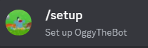

* Sau gửi lệnh thì Oggy sẽ trả về menu này: 

    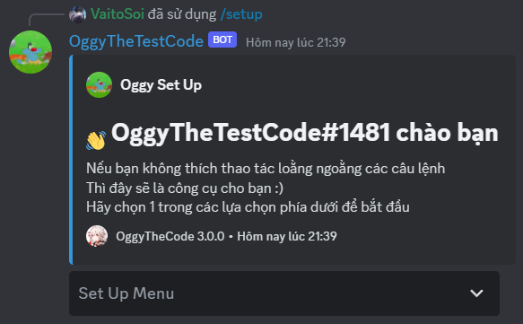

* Tiếp theo, lần lượt chọn các lựa chọn để setup:

    * Permission Check: Kiểm tra lại các quyền của bot.
        
    * Set Channels:

        * Set Livechat: Cài đặt kênh livechat.

        * Set Status: Cài đặt kênh status.

        **Lưu ý:** Sau khi chọn `Set Livechat` hay `Set Status`, Oggy sẽ hiện thêm một menu để chọn kênh. Lúc này, bạn hãy chọn kênh cần cài đặt.

* Sau khi đã cài đặt mọi thứ thì, bạn chọn `Close Menu` để dóng menu.

* Waila, bạn đã sẵn sàng để dùng bot rồi đấy 😊.

### 2. Dùng tổ hợp các lệnh khác:

* Cuộc đời quá dễ và bạn muốn đi đường vòng, đừng lo vì đã có Oggy.

#### 1. Kiểm tra Quyền:

* Nhập lệnh `/permission`.

    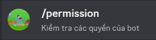
    
* Nó sẽ hiện lên menu như thế này:

    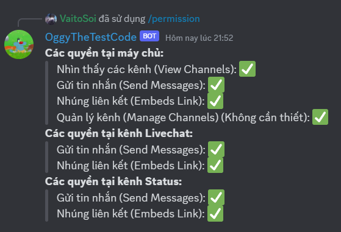

* ! Hãy cố gắng cho bot có đủ quyền để bot có thể chạy một cách trơn tru nhất có thể..
    
* Nếu tại ô `Các quyền tại kênh ...` hiện dòng `Chưa cài đặt ...` thì là do bạn chưa cài đặt kênh đấy :)), lát nữa ta sẽ bàn sau.

#### 2. Set Up Config:

* Để tránh gây hoang mang thì `config` với `CSDL` ở đây đều mang nghĩa là cài đặt của guild của bạn.
    
1. Tạo config:
        
    * Nhập lệnh `/config create`.

        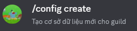

    * Bot sẽ trả về 2 trường hợp:
        
        1. Nếu bot trả về kết quả này thì bạn đã thành công rồi đấy (Các thông số sẽ khác nhau tùy vào guild):

            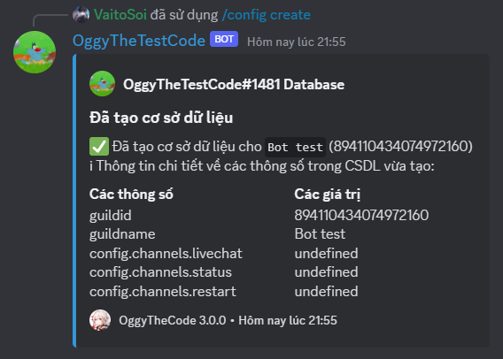

        2. Nếu bot trả về kết quả này thì kệ đi vì bạn đã có config sẵn rồi:

            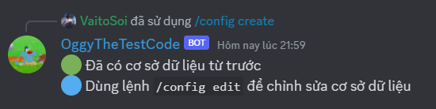

2. Set Up Channel:

    * Dùng lệnh `/config edit channel <type> <channel> [feature]`:

        * <type>: Loại kênh muốn set up.

        * <channel>: Kênh muốn set up.

        * [feature]: Bật các tính năng lên (mặc định: True, cứ để yên nếu muốn bot chạy bình thường).

            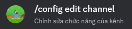

        * VD: Mình muốn setup loại kênh `livechat` ở kênh `#livechat` thì mình sẽ nhập như sau:

            

        * Và bot sẽ trả về như sau:

            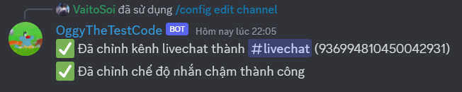

3. Kiểm tra kênh:

    * Khi bạn đã setup kênh xong nhưng sợ sai, đừng lo vì đã có Oggy.

    * Nhập lệnh `/config show`:

        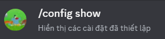

    * Sau khi nhập lệnh thì bot sẽ trả về menu hiện thông số của config của guild hiện tại:

        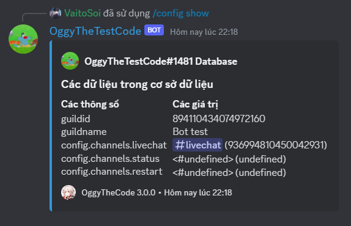

4. Xóa config

    * Nếu bạn không muốn sài bot nữa, thì đừng lo vì đã có Oggy :)

    * Sẽ có 2 trường hợp:

    1. Xóa toàn bộ config:
        * Ta dùng lệnh `/config delete all`:

            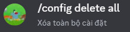

        * Khi gửi lệnh thì bot sẽ trả lại tin nhắn sau để xác nhận: 

            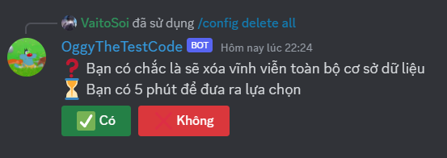

        * Chọn `✅ Có`, bot sẽ nhắn như sau:

            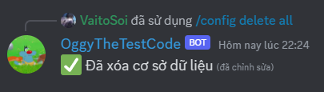

    2. Xóa một kênh chỉ định hoặc toàn bộ kênh:

        * Ta dùng lệnh `/config delete channel <type>`: 

            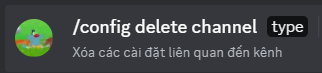

        * Bot sẽ hỏi để xác nhận, bạn chọn `✅ Có`:

            

        * Sau khi xác nhận thì bot sẽ nhắn như sau: 

            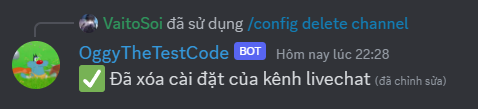

```3. Các câu hỏi và lưu ý:```

1. Kênh `Livechat` với `Status` là gì ?
    
    * Kênh `Livechat` sẽ là nơi bot gửi tin nhắn từ server minecraft về và từ guild discord đi.

    * Kênh `Status` sẽ là nơi hiện menu để cập nhật thông tin về server:

        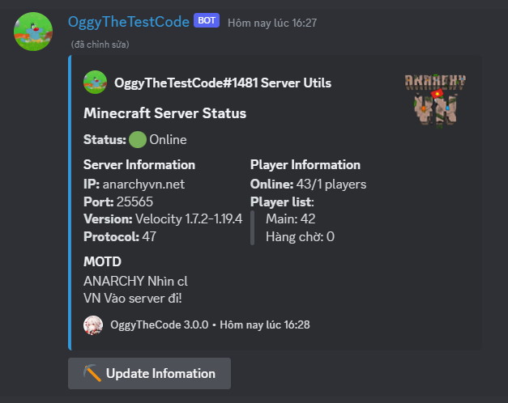

2. Sao đã set up kênh `Livechat` rồi mà sao không thấy tin nhắn ?

    Có hai trường hợp:

    * Bot đang Offline. Hãy kiểm tra status của bot để nắm chắc thông tin.

    * Server chưa gửi tin nhắn. Khi có tin nhắn thì bot mới đến guild

3. Thông tin về các trạng thái của bot:

    Theo config của Oggy thì:

    * Bot để trạng thái `Do Not Distrub` thì bot đang offline

        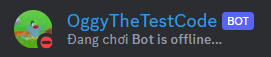

    * Bot để trạng thái `Online` thì bot đang ở trong server

        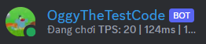